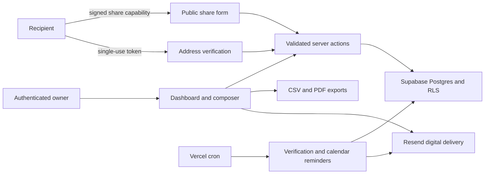

# Dear Friends

Dear Friends is a small Next.js app for keeping a personal mailing-address book, collecting addresses through private share links, remembering important dates, and preparing letters or labels for mail you send yourself.

[Live application](https://dearfriends.vercel.app) · [Product requirements](PRD.md) · [Security policy](SECURITY.md)

The app is built for a quiet, single-user correspondence workflow:

- collect addresses through signed public share links
- manage contacts, groups, delivery preferences, birthdays, and notes
- draft reusable letters with simple `{{first_name}}` and `{{last_name}}` variables
- export Avery-ready CSV labels and PDFs for physical mail
- send digital letters and reminder emails through Resend
- import calendar subscriptions and calculate practical mail-by dates

## Why this project

Personal mailing lists sit in an awkward gap: spreadsheets collect data but do not provide a considerate recipient experience, while sales CRMs add the wrong workflows and tone. Dear Friends treats correspondence as a trust-sensitive product problem spanning public data collection, tenant isolation, address verification, physical-mail preparation, digital delivery, and scheduled reminders.

The repository is designed to demonstrate product judgment as well as implementation: high-consequence actions preview their audience, asynchronous mutations report their real persistence state, public links fail closed, and automated release gates cover security boundaries alongside user flows.

## Architecture



### Engineering highlights

- **Server-mediated public mutations:** share slugs resolve to short-lived signed capabilities; verification links are UUID-validated, single-use, and expire after 14 days.
- **Tenant-safe relationships:** Supabase RLS and database triggers protect contact, group, calendar, and share-slug boundaries.
- **Recoverable correspondence workflows:** drafts serialize autosaves, bulk actions show server-derived audiences, and partial digital-send failures can be retried without repeating successful sends.
- **Hybrid delivery model:** the app prepares Avery-compatible CSV and personalized PDFs for user-managed physical mail while sending only contacts explicitly marked digital.
- **Timezone-aware planning:** date-only calendar calculations use the owner’s saved timezone and generate practical mail-by reminders.
- **Release discipline:** lint, typecheck, unit/security tests, production build, and browser smoke tests gate deployment.

## Tech Stack

- Next.js App Router
- TypeScript
- Supabase Auth, Postgres, and Row Level Security
- Tailwind CSS
- React Hook Form and Zod
- Resend
- Playwright and Vitest

## Getting Started

Install dependencies:

```bash
pnpm install
```

Create local environment variables:

```bash
cp .env.example .env.local
```

Fill in the Supabase and Resend values in `.env.local`, then run the app:

```bash
pnpm dev
```

Open [http://localhost:3000](http://localhost:3000).

## Environment Variables

| Variable | Purpose |
| --- | --- |
| `NEXT_PUBLIC_SUPABASE_URL` | Public Supabase project URL |
| `NEXT_PUBLIC_SUPABASE_ANON_KEY` | Public Supabase anon key |
| `SUPABASE_SERVICE_ROLE_KEY` | Server-only Supabase service role key |
| `RESEND_API_KEY` | Server-only Resend API key |
| `RESEND_FROM_EMAIL` | Verified sender address for Resend |
| `NEXT_PUBLIC_SITE_URL` | Public app URL used in generated links |
| `CRON_SECRET` | Bearer token shared with scheduled cron calls |
| `GOOGLE_GEOCODING_API_KEY` | Optional server-side geocoding key; U.S. addresses can fall back to Census geocoding |
| `E2E_USER_EMAIL` | Optional seeded test-account email for authenticated Playwright flows |
| `E2E_USER_PASSWORD` | Optional seeded test-account password for authenticated Playwright flows |

Never expose server-only variables with a `NEXT_PUBLIC_` prefix.

## Database

SQL migrations live in `supabase/migrations`. Apply them in order to a Supabase project before using the dashboard flows.

Migration versions are unique and immutable once published. `012_reconcile_schema_history.sql` safely reconciles environments that originated from older snapshots or the repository’s former duplicate `006` version. New schema changes should use the next numeric version rather than renaming applied history.

The security model assumes:

- authenticated dashboard reads/writes are scoped by Supabase RLS
- public share links use signed server capabilities instead of client-supplied admin IDs
- verification links are single-use and expire
- cron routes fail closed unless `CRON_SECRET` is set and supplied

## Scripts

```bash
pnpm dev          # local development
pnpm lint         # ESLint
pnpm build        # production build
pnpm typecheck    # TypeScript check
pnpm test         # Vitest unit tests
pnpm test:e2e     # Playwright tests
```

Public Playwright flows always run. Authenticated dashboard, compose, calendar, and map checks run when `E2E_USER_EMAIL` and `E2E_USER_PASSWORD` point to a completed-onboarding test account. Keep that account isolated from production data.

At the current checkpoint, the repository passes strict ESLint, TypeScript, 96 Vitest unit/security tests, a production Next.js build, and the always-on public Playwright flows. Credential-gated tests inspect authenticated confirmation paths without executing real bulk sends.

## CI/CD

GitHub Actions runs the full release gate on every branch push and pull request:

```bash
pnpm install --frozen-lockfile --ignore-workspace
pnpm lint
pnpm typecheck
pnpm test
pnpm build
pnpm test:e2e
```

The Vercel deploy job runs only after those checks pass. Pull requests from the same repository receive preview deployments, `main` deploys to production, and manual runs can opt into production. Configure these repository secrets before enabling deployment:

- `VERCEL_TOKEN`
- `VERCEL_ORG_ID`
- `VERCEL_PROJECT_ID`

If the project is also connected to Vercel's built-in Git integration, disable one of the deploy paths to avoid duplicate deployments.

## Deployment

The repository includes `vercel.json` for scheduled reminder jobs. Production deploys should run:

```bash
pnpm install --frozen-lockfile --ignore-workspace
pnpm build
```

Set all environment variables in the hosting provider. Do not commit `.env.local`.

## Security

Please see [SECURITY.md](SECURITY.md) for supported reporting practices.

## License

MIT
